# Smart Coffee Machine: Workshop Exercise

**Task overview:** Energizer 4500 is a smart coffee making machine with wireless connection and a smartphone app. Review the list of features of Energizer 4500. Pick one advanced task that the user might want to achieve using the machine with or without the app and write a procedure for it.

**Task requirements:**

* Your procedure should adhere to the recommendations for good documentation you have received.
* Your procedure should consist of the following elements:
	* A task-oriented title that expresses the user goal
	* A prerequisites section, if needed
	* Step-by-step breakdown of the procedure

**Tip:** You can download Smarter 2.0 from App Store or Google Play to see how a real companion app for a smart coffee machine looks like.

## Energizer 4500

Features:

* Wireless 802.11 b/g/n
* Removable water reservoir for easier cleaning
* Removable brewing chamber for easier cleaning
* Programmable grinder
* Adjustable brewing temperature
* Smartphone app
	* Scheduler
	* Notifications
	* Reminders when the machine requires cleaning or a refill
	* Programmable alarms
	* Remote control

Smartphone app screenshots:

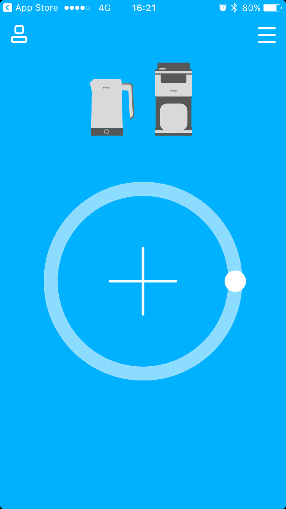

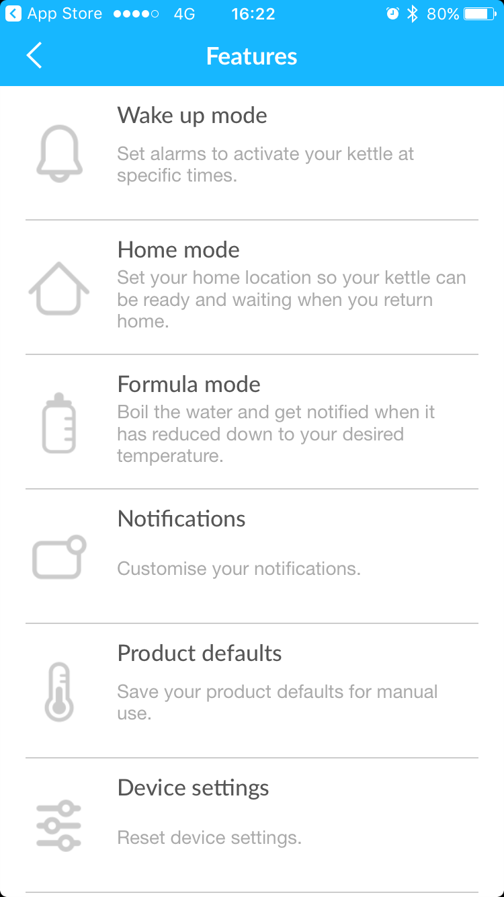

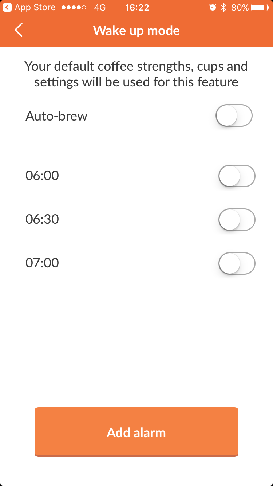&nbsp;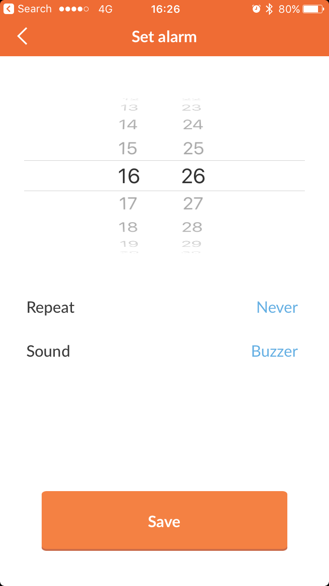

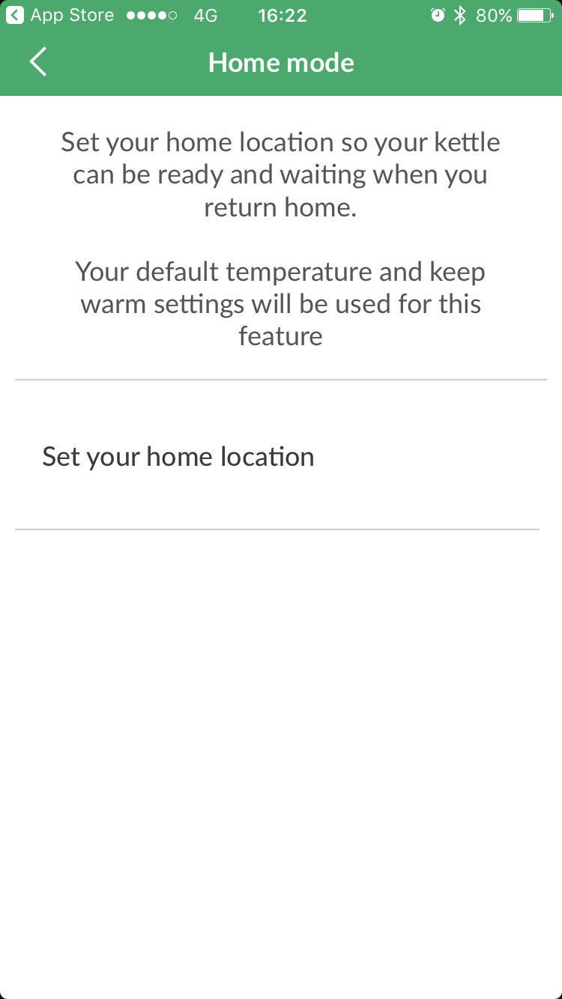&nbsp;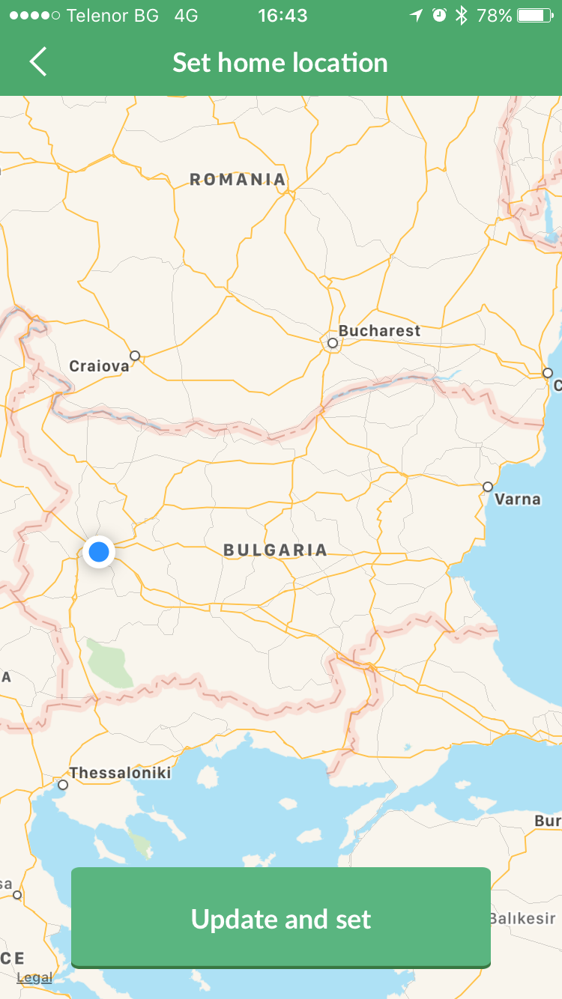&nbsp;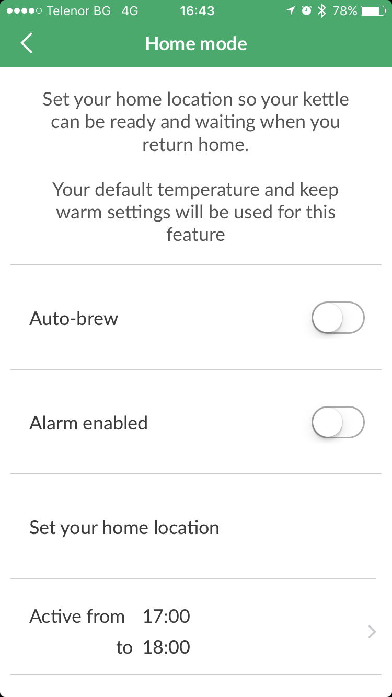

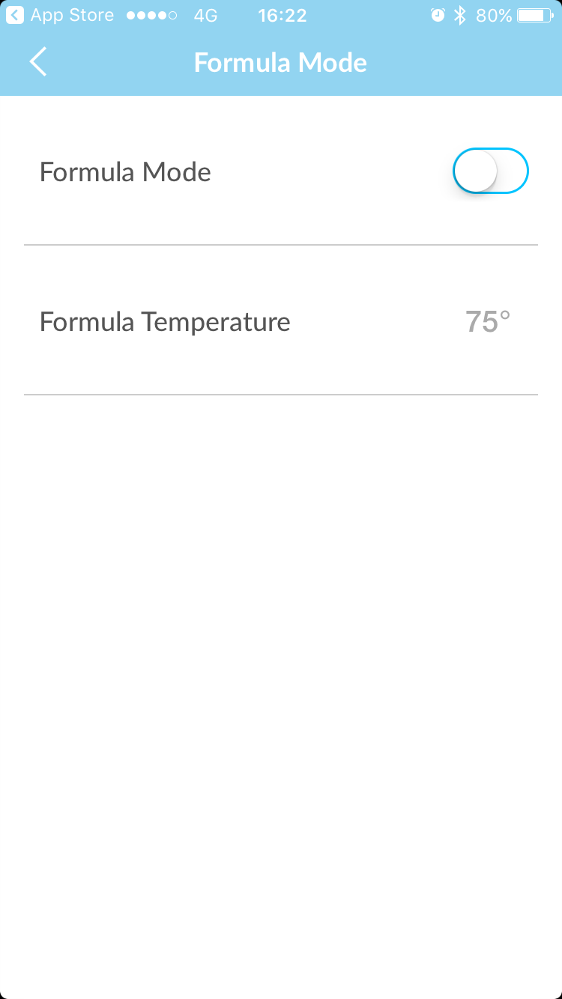

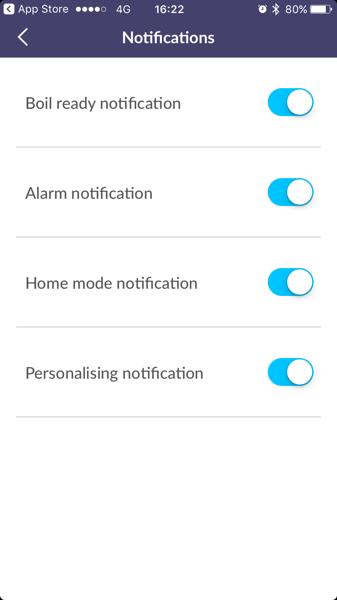

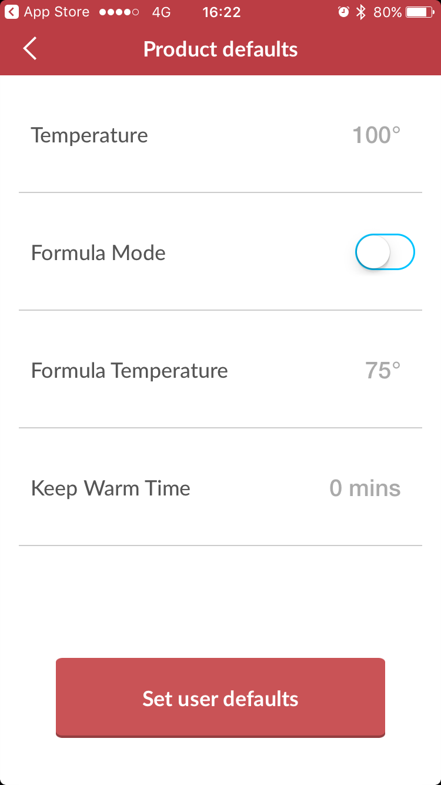

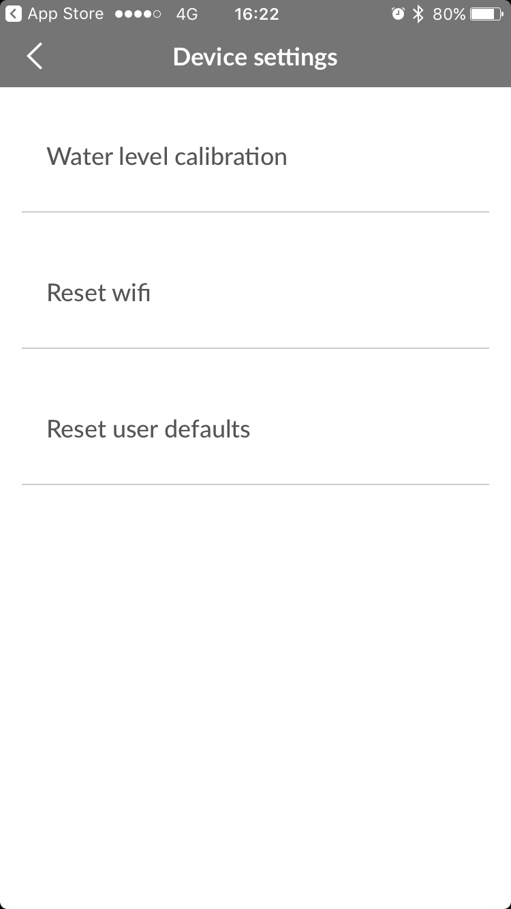
